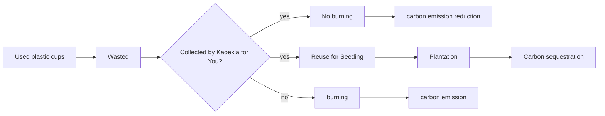

# Carbon Reduction
_A Case Study on ZPOT Kaeokla for You Project_

## Background
__Kaeokla for You__ is a carbon emision reduction and CO<sub>2</sub> reduction project run by Zoological Park Organization of Thailand (ZPOT), the Ministry of Natural Resources and Environmnet. I was consulted on how to evaluate the positive impact on carbon reduction from the project. Therefore, I built a web app for evaluating the potential atmospheric carbon absorption and the potential carbon emission reduction due to the project, deployed at https://esc.mnre.go.th/app/co2/

The outcome of the Kaeokla for You Project, in my view, are displayed below.


Considering both carbon emission reduction and carbon sequestration, we have:

## Carbon Emission Reduction (CER)
> _CER = c * w * e_    

where,
- _CER_ is carbon emision reduction (tonCo2eq)
- _c_ is the number of burned plastic cups (cups)
- _w_ is the weight of one plastic cup (0.015 kg) 
- _e_ is the average emission factor from plastic cup burning (3.54 kgCo2eq/kg).

## Carbon Sequestration(CS)
> _CS = n * m * t * 1/d * s_

where,
- _CS_ is carbon sequestration (tonCo2eq/year)
- _n_ is the number plastic cups collected (cups/month)
- _m_ is the number of months per year (12 months/year)
- _t_ is the number of plant seed per cup (seed/cup) 
- _d_ is the plantation density (200 trees/Rai)
- _s_ is sequestration rate, depending on tree species and the suitable of the crop land, expressed in JavaScript as follows:
  
```
var cr = "";
if(tree=="sak" && area=="much"){cr=2.16;}
else if(tree=="yuka" && area=="much"){cr=6.09;}
else if(tree=="thepha" && area=="much"){cr=6.09;}
else if(tree=="narong" && area=="much"){cr=4.4;}
else if(tree=="yak" && area=="much"){cr=6.49;}

else if(tree=="sak" && area=="moderate"){cr=1.72;}
else if(tree=="yuka" && area=="moderate"){cr=4.77;}
else if(tree=="thepha" && area=="moderate"){cr=4.4;}
else if(tree=="narong" && area=="moderate"){cr=3.48;}
else if(tree=="yak" && area=="moderate"){cr=4.8;}

else if(tree=="sak" && area=="less"){cr=1.36;}
else if(tree=="yuka" && area=="less"){cr=3.15;}
else if(tree=="thepha" && area=="less"){cr=4.00;}
else if(tree=="narong" && area=="less"){cr=2.27;}
else if(tree=="yak" && area=="less"){cr=0.77;}

else{cr=0;}
```
__Source__: Modified from TGO (2559, [PDF](https://esc.mnre.go.th/app/co2/Tree_version02.pdf))
