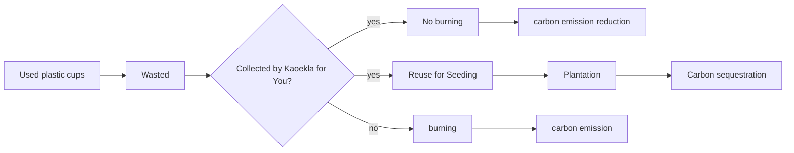

# Carbon Reduction
_A Case Study on ZPOT Kaeokla for You Project_

## Background
__Kaeokla for You__ is a carbon emision reduction and CO2 reduction project run by Zoological Park Organization of Thailand (ZPOT), the Ministry of Natural Resources and Environmnet. I was consulted on how to evaluate the positive impact on carbon reduction from the project. Therefore, I built a web app for evaluating the potential atmospheric carbon absorption and the potential carbon emission reduction due to the project, deployed at https://esc.mnre.go.th/app/co2/

The outcome of the Kaeokla for You Project, in my view, are displayed below.

Considering both carbon emission reduction and carbon sequestration, we have:

## Carbon Emission Reduction (CER)
> CER = c * w * e

where,
- CER is carbon emision reduction (tonCo2eq)
- c is the number of burned plastic cups (cups)
- w is the weight of one plastic cup (0.015 kg) 
- e is the average emission factor from plastic cup burning (3.54 kgCo2eq/kg).

## Carbon Sequestration(CS)
> CS = n * 12 * t * 1/d * s 

where,
- CS is carbon sequestration (tonCo2eq/year)
- n is the number plastic cups collected (cups/month)
- 12 is the number of months per year
- t is the number of plant seed per cup (seed/cup) 
- d is the plantation density (200 trees/Rai)
- s is sequestration rate for each tree species, depending on the suitable of the land:
  
