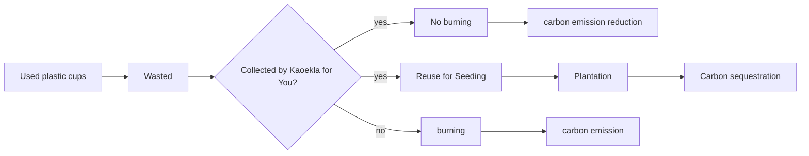

# Carbon Reduction
_A Case Study on ZPOT Kaeokla for You Project_

## Background
__Kaeokla for You__ is a carbon emision reduction and CO2 reduction project run by Zoological Park Organization of Thailand (ZPOT), a governmental agency under the Ministry of Natural Resources and Environmnet. The project has been initiated by Yada Kaeosod. She asked me to evaluate the potential positive carbon impact of the project. Hence, I reviewed some relevant carbon works and developed a web application, deployed at https://esc.mnre.go.th/app/co2. The goal is to make it easier and faster to assess the potential project outcome: Carbon emission reduction and sequestration from plastic cups resue for plantation.

The outcome of the Kaeokla for You Project can be displayed as follow:

Hence, we have both carbon emission reduction and carbon sequestration in one project.

## Carbon Emission Reduction (CER)
> [!NOTE]
> CER = C * w * EF 

where,
- CER is carbon emision reduction (tonCo2eq)
- C is the number of burned plastic cups (cups)
- w is the weight of one plastic cup (0.015 kg) 
- EF is the average emission factor from plastic cup burning (3.54 kgCo2eq/kg).

## Carbon Sequestration(CS)
> [!NOTE]
> CS = N * 12 * T * 1/d * s 

where,
- CS is carbon sequestration (tonCo2eq/year)
- N is the number plastic cups collected (cups/month)
- 12 is the number of months per year
- T is the number of plant seed per cup (seed/cup) 
- d is the plantation density (200 trees/Rai)
- s is sequestration rate for each tree species, depending on the suitable of the land:
  
